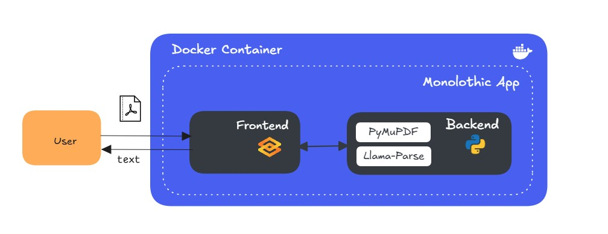
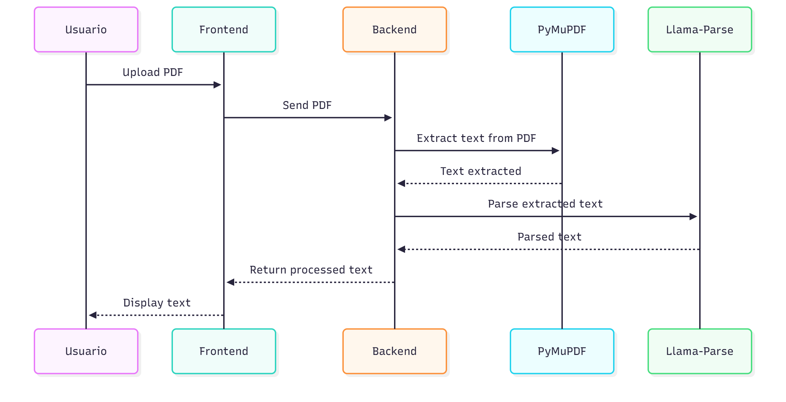

# PDF Text Extractor

## Objective
Developed an app to extract text from PDFs using libraries such as PyMuPDF and llama-parse for text extraction.

## Architecture
A high-level architecture diagram that illustrates the structure of a monolithic application deployed inside a Docker container. It shows the interaction between the user, the frontend, and the backend.



## `Sequence Diagram`

Basic flow for the sequence diagram:

1. The User sends a PDF to the Frontend.
2. The Frontend receives the PDF.
3. The Frontend sends the PDF to the Backend for processing.
4. The Backend uses PyMuPDF to extract text from the PDF.
5. The Backend uses Llama-Parse to process (parse or analyze) the extracted text.
6. The Backend returns the processed text to the Frontend.
7. The Frontend displays the text to the User.

## Tech Stack


## Project Structure
```bash
pdf_text_extractor/
├── .dockerignore        # Files and folders to exclude from Docker builds
├── .env                 # Environment variables (keep secret)
├── .env.example         # Example environment variables
├── .gitignore           # Git ignore rules
├── .python-version      # Python version used in the project
├── .venv/               # Local virtual environment (ignored in git)
├── data/                # Folder for input/output data (PDFs, extracted text, etc.)
├── dist/                # Distribution or build files
├── docs/                # Documentation files
├── main.py              # Entry point of the application
├── notebook/            # Jupyter notebooks for experiments or testing
├── pyproject.toml       # Project dependencies and metadata
├── README.md            # Project README file
├── Dockerfile           # Dockerfile to build the container
├── src/                 # Source code for the project
└── uv.lock              # Dependency lock file for uv
```

## Installation 

✅ 1. Clone the repository
```bash
git clone https://github.com/estelacode/pdf_text_extractor.git
cd pdf_text_extractor
```

✅ 2. Create and activate a virtual environment
```bash
py -3.13 -m venv .venv
.venv\Scripts\activate  # Windows
# or
source .venv/bin/activate # Linux/macOS
```
✅ 3. Install UV
```bash
pip install uv
```

✅ 4. Install dependences from .toml file.
```bash
uv pip install -e .
```

✅ 5. Configure the .env file


## Project Setup

☑️ Step 1: Create Virtual Enviroment
```bash
py -3.13 -m venv .venv
```

☑️ Step 2: Activate Virtual Enviroment
```bash
.venv\Script\activate
```

☑️ Step 3: Install UV
```bash
pip install uv
```

☑️ Step 4: Create a project with uv
```bash
uv init
```
☑️ Step 5: Link my local repository to my Github remote repository
```bash
git remote add origin https://github.com/estelacode/pdf_text_extractor.git
git remote -v  # Verify the remote repository is added
```

☑️ Step 6: Add first commit and push the current branch and set the remote as upstream
```bash
git add README.md
git commit -m "README.md"
git push --set-upstream origin master 
git push -u origin master
```

☑️ Step 7:  Add and remove dependencies
```bash
uv add [OPTIONS] <PACKAGES>...  # Add dependencies to the project
uv remove [OPTIONS] <PACKAGES>... # Remove dependencies from the project.
```

## Usage
```bash
cd pdf_text_extractor
uv run main.py 
# navigate to http://localhost:7860/
```

## Build the artifact
```bash
uv build
```
## Requirements
```bash
uv pip freeze > requirements.txt
```

## Developer mode
```bash
uv pip install -e . #
uv pip install --editable . # Install the editable package based on the provided local file path.
```

## Devops 
0. Generate the whl file in the dist folder
```bash
uv build
```
1. Build a Docker image with the code and dependencies from my project.
```bash
docker build -t pdf_text_extractor . # build your Docker image
docker images # list docker images
docker rmi <docker_image-id> # remove the docker image with image id (Ex.1bec6217270e)
```
2. Create and run a docker container
```bash
docker run -d -p 8080:8080 pdf_text_extractor
docker ps -a # list all the docker containers
docker rm -f <container-id> #remove the docker container with id (Ex.cf99422731ef)
```
3. Create a docker container with enviroment variables
```bash
docker run -d -p 8080:8080 -e LLAMA_CLOUD_API_KEY="XXXXXXXXXXXXXXXXXXXXXXXXXX" pdf_text_extractor
```


## Tech Stack
* [Gradio](https://www.gradio.app/docs)
* [Docker Desktop Community](https://docs.docker.com/)
* [uv](https://docs.astral.sh/uv/concepts/projects/dependencies/)

#### PDF Procesing Libraries
* [Llama Parse](https://www.llamaindex.ai/llamaparse)
* [Llama Parse-Getting Started](https://developers.llamaindex.ai/python/cloud/llamaparse/getting_started/)
* [PyMuPDF](https://github.com/pymupdf/PyMuPDF)
* [pdfminer.six](https://pypi.org/project/pdfminer.six/)


* [IMAGEBIND: One Embedding Space To Bind Them All](https://arxiv.org/pdf/2305.05665)


### 👋 Author
Estela Madariaga